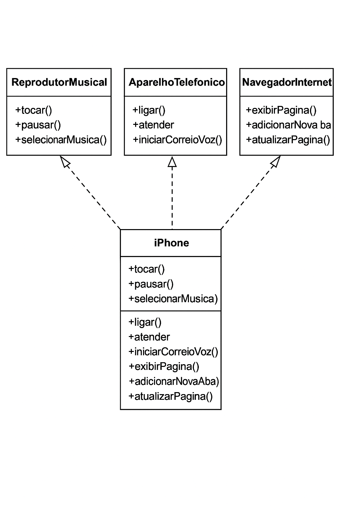

# 📱 Projeto iPhone em Java

Este projeto simula as funcionalidades principais do iPhone usando os conceitos de Programação Orientada a Objetos (POO) e modelagem UML.

## 🚀 Funcionalidades

- 🎵 Reprodutor Musical
- 📞 Aparelho Telefônico
- 🌐 Navegador de Internet

## 🧠 Tecnologias Usadas

- Java 17+
- Programação Orientada a Objetos
- UML (Diagrama de Classes)

## 📂 Estrutura

- `ReprodutorMusical`, `AparelhoTelefonico`, `NavegadorInternet` → interfaces
- `iPhone` → classe que implementa todas as interfaces
- `Main` → classe de teste

## 📌 UML

## 👨‍💻 Autor

Vinicius Gonçalves da Silva Pita
